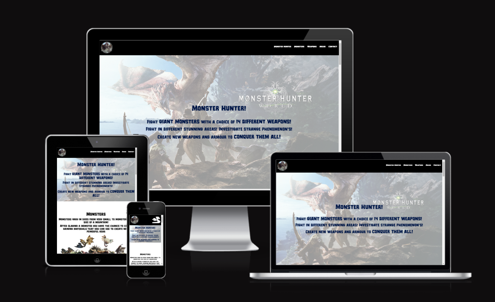
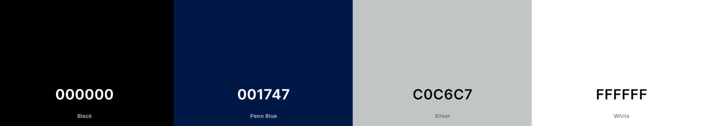
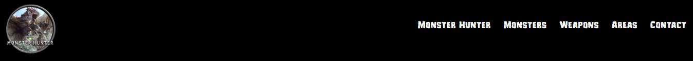
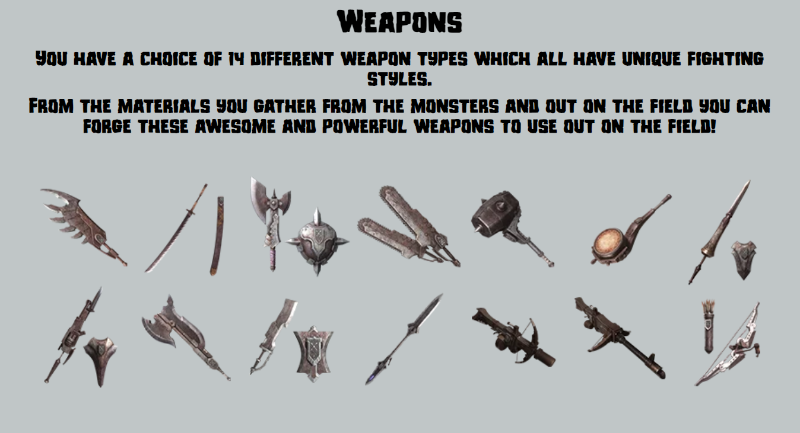

# Monster Hunter Website

This Monster hunter website is for the gaming community, to showcase the game and give an introduction to the game and it's content

The sections on this website will give you a peak into the games purpose, types of monsters you will encounter, weapons you can make, the areas you can explore and a form to be able to join the social media communities for more content.

### The live website can be seen by clicking [here](https://jordan-bungay.github.io/project-1-Monster-Hunter/)

## UX

The Users targetted by this website are, Gamers and content creators. I want people to use my website for reccomendations and to get more people to join the social media pages. My website is easy to use and to get someone interested quickly without too much information to overwhelm you. A lot of pictures are used to keep the audience engaged and to showcase what will be awaiting you in the game.

## User stories

The goal of this website is to get people interested in this game and to get recognised as a good content provider on the internet. The following points are from my user point of view:

* As a user, I want to be able to open the website and navigate easily.
* As a user, I want to see what the monster hunter game is all about.
* As a user, I want see what kind of content there is in the game.
* As a user, I want to be able to join a group for frequent content updates and upcoming events.
* As a user, I want to learn tips and tricks from other people who play this game in a community.

## Strategy

I want the website to be user-friendly and easy to use on all platforms, the users need to be able to navigate through the website and get the information and content they have come for without difficulty.

## Scope

For the users, I want them to see brief introduction to what the game entails without having too much information but enough to get them wanting more. Having a way of joining a social community to extra content is a good way of making it so they are then actively looking rather than throwing it in their face. Having lots of pictures but having the balance between the text and images is key.

## Structure

The structure of this website is in a long single page with different sections to scroll to, as it is better for the user experience when being introduced to a game for the first time. In the header I have the navigation bar that follows you down the page making it easy to navigate to any section wherever you are on the page.

**Website Sections:**

1. **_Monster Hunter (home/first section):_** Brief introduction to the game and what it's about.
2. **_Monsters:_** The monsters section show cases the kind of monsters you will encounter.
3. **_Weapons:_** The weapons section show cases the differet types of weapons you can create.
4. **_Areas:_** The Areas section show cases the different kinds of areas you will go to.
5. **_Contact:_** The contact section gives you the input fields for basic user information and a bit of fun with choosing a weapon type, there is also the social media links you can click on to go straight to the page.

## Skeleton

I designed the website to be simple but show case all the relevant information and pictures required to get the users interested.

**Wireframe**

I used balsamiq software recommended by my mentor to create my wireframe for my website. The wireframe shows the very basic structure of what I saw in my head and gave guidence in to how i wanted my website structured.

You can view the screenshots from my wireframe from clicking the following:

[Click me](assets/readme-assets/Wireframe-screenshot-1.png)

[click me](assets/readme-assets/Wireframe-screenshot-2.png)

[Click me](assets/readme-assets/Wireframe-screenshot-3.png)

[Click me](assets/readme-assets/Wireframe-screenshot-4.png)

[Click me](assets/readme-assets/Wireframe-screenshot-5.png)

[Click me](assets/readme-assets/Wireframe-screenshot-6.png)

## Surface

The Colors I have used in the website are used to match the theme of the images, and matches the main colors seen in the game. I chose the color of silver mainly for the weapons section, as it is the colour of steel and wanted to have that relation in the website.

### Color palette used:

## Technologies

I have used HTML for the main page structure, images and text content.
I have used CSS for the styling and positioning of all the HTML content.
I have used Balsamiq for the wireframe plan of my website.

## Features

**Navigation Bar**

* The navigation bar is fixed to the top of the screen and follows you down the page as you scroll.
* On the left hand side is the logo which you are able to click on to take you to the start of the page.
* On the right hand side is the navigation links Monster hunter, Monsters, Weapons, Areas and Contact. If you hover over them on larger screen sizes they will highlight and once clicked on will take you to the relevant section. On smaller screen sizes there is a icon on the right that you can click on to bring up a dropdown with the navigation links.

**Monster Hunter(Home)**

* The Home section is called Monster Hunter Which gives a brief introduction to the game and what it's about.
* The background image is of one of the monsters in the game and some hunters giving a feel for the kind of content you will see in game.
  
.png)

**Monsters**

* The monsters section showcases large monsters, small monsters and icons of the monsters that you will see in game.
* There is 3 images in this section, the main image being for the large monsters and 2 smaller images underneath showing the small monsters and icons that you will see in the game.
* There is a title above each of the 3 images to show what they are.

.png)

.png)

**Weapons**

* The Weapons section showcases the 14 different weapons you will be able to use in the game and give a brief introduction.
* Under the description is an image showing the 14 different weapons you will encounter when playing.

**Areas**

* In this section you will be able to see the 6 different areas that you will visit in the game.
* The names of the areas are on the left hand side of the images as you scroll down the page.
* The images showing the areas are on the right hand side of the page as you scroll down the page.

.png)

.png)

.png)

.png)

**Contact**

* The contact section is a way of the user to get more information by joining a community for future content.
* This section gives a bit of text to draw the user in to want to join the community.
* There are the input fields for the users details first name, last name and email address.
* There are some buttons for the user to select to ask what kind of weapon they like the look of.
* Lastly the social media links to the pages are at the buttom for the user to go and visit.

.png)

.png)

## Testing

* I tested the site, and it works in different web browsers Chrome, Firefox, and Microsoft Edge.
* On mobile devices, I tested my site on a iPhone 12 with the Safari browser.
* I confirmed that the site is responsive and functions on different screen sizes using the devtools device toolbar.
* I confirmed that the navigation and the sections Monster Hunter, Monsters, Weapons, Areas, and Contact are readable and easy to understand.
* I confirmed that the form works, it requires entries in every field, only accepts an email in the email field and the submit button works.

## Validator Testing

**HTML**
  
  No errors were found when passing through the official [W3C validator](assets/readme-assets/HTML-Validator-results.png)

**CSS**
  
  No errors were found when passing through the official [(Jigsaw) validator](assets/readme-assets/CSS-Validator-results.png)
  
**Accessibility**
  
  I confirmed that the colors and fonts chosen are easy to read and accessible by running it through [Lighthouse DevTools](assets/readme-assets/Lighthouse-results.png)

## Bugs

A bug I encountered when creating this website was with the header section, where the navigation links wouldn't show aligned to the right of the header and central.

My mentor showed me some flex-box tricks to get this to sit properly in the header:

* display: flex;
* justify-content: space-between;
* align-items: center;

Whereas I had tried using inline-block.

## Deployment

I used the following steps to deploy my project:

* Go to my Github repository.
* Click on the settings tab.
* Under General, go to Code and Automation and select 'Pages'.
* In the Build and Deployment section for Source, select 'Deploy from a branch' from the drop-down list.
* For Branch, select 'main' from the drop-down list and Save.
* On the top of the page, the link to the complete website is provided.

## Credit

### Pictures

* Font url was taken from "https://www.cdnfonts.com/monster-hunter.font"
* Logo image was taken from "https://www.steamgriddb.com/icon/41405"
* Form background image taken from "https://wall.alphacoders.com/big.php?i=135693"
* Home page image taken from "https://www.psu.com/wallpapers/monster-hunter-world-and-iceborne-wallpapers/"
* Monsters section first image taken from "https://www.ign.com/wikis/monster-hunter-world/Large_Monsters"
* Small monsters image taken from "https://www.ign.com/wikis/monster-hunter-world/Small_Monsters"
* Monster icons image taken from "https://www.redbubble.com/i/sticker/Monster-Hunter-Icons-monster-hunter-rise-pack-1-by-HarrisonWasHere/148472122.EJUG5"
* Weapons image taken from "https://www.monsterhunter.com/world/pc/us/"
* Images for areas section taken from "https://www.monsterhunter.com/world/us/"
* icons used are from "https://fontawesome.com/"

### Content

* Some of the code for the form and header was taken from the [Love Running project]
* Some of the Home section Code to allow the content to sit on top of the image was taken from [anjalee-kulasinghe](https://github.com/anjalee-kulasinghe/portfolio-project1-cv-website/blob/main/README.md?plain=1)

### Acknowledgements

* Inspiration is from [anjalee-kulasinghe](https://github.com/anjalee-kulasinghe/portfolio-project1-cv-website/blob/main/README.md?plain=1) project.
* Ideas were taken from the Code Institute's Coffee House and Love Running projects.
* The the Code Institute tutor support team for helping me with the correct guidance.
* My mentor, Medale Oluwafemi, for his invaluable guidance.
